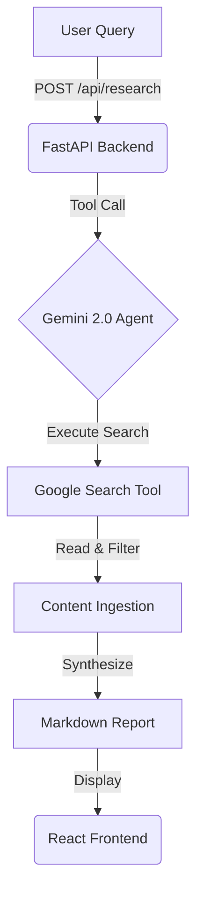

# The Scholar: Recursive Knowledge Synthesis Engine 🎓

> **"Search engines give links; The Scholar gives answers."**


## 📜 The Philosophy
In the age of information overload, truth is hidden in the noise. **The Scholar** is an agent designed for **Track 4: The Scholar**. It moves beyond simple summarization to perform "Deep Research"—investigating topics, cross-referencing live data, and synthesizing structured, academic-grade reports.

## 🧠 The Intelligence
Powered by **Gemini 2.0 Flash** with **Grounding (Google Search)**, The Scholar capabilities include:
*   **Live Data Access:** Breaks the knowledge cutoff by querying the web in real-time.
*   **Source Verification:** Every claim is backed by a clickable citation.
*   **Structured Synthesis:** Transforms chaotic search results into clean Markdown.

## ⚡ Architecture



## 🚀 Quick Start

### Prerequisites
*   Python 3.10+
*   Node.js 18+
*   Google Gemini API Key

### 1. The Engine (Backend)
```bash
cd backend
python3 -m venv .venv
source .venv/bin/activate
pip install -r requirements.txt

# Create .env file
echo "GOOGLE_API_KEY=your_key_here" > .env

# Start the Scholar's Engine (Port 8001)
python3 -m uvicorn main:app --port 8001 --reload
```

### 2. The Interface (Frontend)
```bash
cd frontend
npm install
npm run dev
```

Visit `http://localhost:5173` to start your research.

## 🛠️ Tech Stack
*   **Model:** Google Gemini 2.0 Flash (with Search Tooling)
*   **Backend:** FastAPI (Python)
*   **Frontend:** React + TypeScript + React-Markdown
*   **Deployment:** Docker / Railway ready

## 🔮 Future Roadmap
- [ ] **Recursive Depth:** Agent loops until it is satisfied with the evidence.
- [ ] **PDF Ingestion:** Read academic papers directly.
- [ ] **Export:** Generate PDF/Docx reports.
