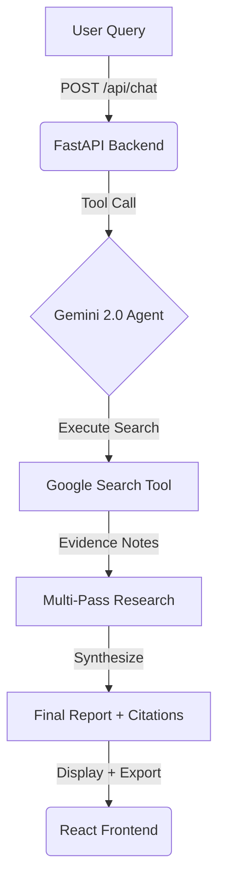

# The Scholar: Deep Research Synthesis Engine

> **"Search engines give links; The Scholar gives answers."**


## 📜 The Philosophy
In the age of information overload, truth is hidden in the noise. **The Scholar** is an agent designed for **Track 4: The Scholar**. It moves beyond summarization to perform **deep research**: it plans, searches, verifies, and synthesizes a complete report. It never asks the user to do the research.

## 🧠 The Intelligence
Powered by **Gemini 2.0 Flash** with **Grounding (Google Search)**, The Scholar capabilities include:
* **Live Data Access:** Breaks the knowledge cutoff by querying the web in real-time.
* **Evidence First:** Every claim is backed by a clickable citation or explicitly marked as a limitation.
* **Structured Synthesis:** Converts noisy search results into a clean report with sections and sources.
* **No Hand-Offs:** The agent never asks the user to gather information.

## ✅ What It Delivers
* Deep research reports with inline citations.
* Multi-pass research with visible progress status.
* Markdown export and **slide-style PDF export** (colorful 16:9 deck).
* Modern, clean UI optimized for demo recording.

## ⚡ Architecture



## 🚀 Quick Start

### Prerequisites
*   Python 3.10+
*   Node.js 18+
*   Google Gemini API Key

### 1. The Engine (Backend)
```bash
cd backend
python3 -m venv .venv
source .venv/bin/activate
pip install -r requirements.txt

# Create .env file
echo "GOOGLE_API_KEY=your_key_here" > .env

# Start the Scholar's Engine (Port 8001)
python3 -m uvicorn main:app --port 8001 --reload
```

### 2. The Interface (Frontend)
```bash
cd frontend
npm install
npm run dev
```

Visit `http://localhost:5173` to start your research.

## ⚙️ Environment Variables
* `GOOGLE_API_KEY` (required): Gemini API key.
* `DEEP_RESEARCH_PASSES` (optional): Number of research passes. Default: 2.
* `DEEP_RESEARCH_MIN_SECONDS` (optional): Minimum time to spend researching. Default: 0.

## 🛠️ Tech Stack
* **Model:** Google Gemini 2.0 Flash (with Search Tooling)
* **Backend:** FastAPI (Python)
* **Frontend:** React + TypeScript + React-Markdown
* **PDF Export:** jsPDF + html2canvas
* **Deployment:** Docker / Railway ready

## 🔮 Future Roadmap
* **Interactive Report View:** Clickable HTML report with inline citations.
* **Charts & Visuals:** Auto-generate simple charts from key numbers.
* **PDF Ingestion:** Read academic papers directly.
